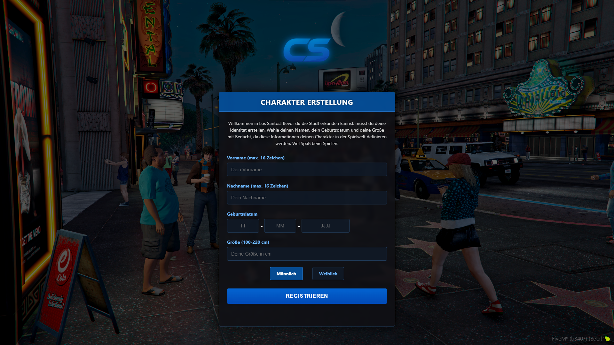

# Modern ESX Identity UI



A completely redesigned, modern user interface for ESX Identity with improved styling, better user experience, and enhanced functionality. Transform your character creation screen into a sleek, fullscreen experience that matches the quality of your FiveM server.

## Features

- **Fullscreen Design** - Immersive GTA 5 background that fills the entire screen
- **Modern UI** - Clean, transparent panels with professional styling
- **European Date Format** - DD-MM-YYYY format instead of MM/DD/YYYY
- **Enhanced Validation** - Clear visual feedback for form fields
- **Responsive Layout** - Looks great on all screen resolutions
- **Easy Customization** - Simple to add your own logo and background

## Preview

| Feature | Description |
|---------|-------------|
| ✅ Fullscreen Background | Immersive GTA 5 themed backdrop |
| ✅ Custom Server Logo | Prominently displays your server brand |
| ✅ Modern Input Fields | Clear visual validation feedback |
| ✅ Custom Date Format | European standard DD-MM-YYYY |
| ✅ Gender Selection | Redesigned toggles for gender choice |

## Installation Guide

### Prerequisites
- FiveM server with ESX framework installed (only tested on ESX 1.2)
- Access to your server files (FTP or direct)
- Basic understanding of server management

### Step 1: Backup Your Original Files
Rename your existing esx_identity folder:

```bash
# Linux
mv /path/to/resources/[esx]/esx_identity /path/to/resources/[esx]/esx_identity_original

# Or use your FTP client to rename the folder
```

### Step 2: Install New Files
Choose one of these methods:

**Option A: Using Git**
```bash
# Navigate to your resources/[esx] folder
cd /path/to/resources/[esx]

# Clone this repository
git clone https://github.com/lvcq4/esx_identity-redesign.git
```

**Option B: Using FTP**
1. Download this repository as a ZIP file
2. Extract it on your local computer
3. Upload the extracted folder to your server's resources/[esx] directory
4. Rename the uploaded folder to "esx_identity"

### Step 3: Add Your Custom Images
1. Replace `html/img/background.jpg` with your preferred GTA 5 background
2. Replace `html/img/logo.png` with your server's logo

**IMPORTANT**: Keep the filenames as `background.jpg` and `logo.png` to avoid having to modify the fxmanifest.lua file. If you wish to use different filenames, you'll need to update the references in the fxmanifest.lua file accordingly.

### Step 4: Configuration
The resource works with default ESX Identity settings, but ensure:

```lua
# In config.lua
Config.UseDeferrals = false  # This enables the in-game registration form
```

### Step 5: Full Server Restart Required
**IMPORTANT**: A simple resource restart will NOT work with ESX Identity modifications!

## Customization

### Changing Text
Edit `html/index.html` to modify any text in the UI:
- Main heading (CHARACTER CREATION)
- Introduction text
- Field labels and placeholders
- Button text

### Changing Colors
Edit `html/css/style.css` to modify the color scheme:
- Find colors like `rgba(0, 100, 200, 0.7)` or `#6bb5ff`
- Replace with your preferred colors

### Advanced Customization
For more advanced changes:
- `html/index.html` - Structure and content
- `html/css/style.css` - Styling and appearance
- `html/js/script.js` - Behavior and functionality
- `server/main.lua` - Date format validation

## Troubleshooting

| Problem | Solution |
|---------|----------|
| Old UI still appears | Clear your FiveM cache: delete `%localappdata%\FiveM\FiveM.app\data\cache` |
| Form doesn't show | Set `Config.UseDeferrals = false` in config.lua |
| NULL values in database | Verify server/main.lua contains the updated date format validation |
| Images not showing | Check image paths and file permissions |
| Date format issues | Ensure all three files were updated correctly |

## License

This project is licensed under [GNU GPL v3.0](LICENSE) - maintaining the same license as the original ESX Identity.

## Credits

- Original ESX Identity © 2015-2022 [ESX Framework](https://github.com/esx-framework) (Jérémie N'gadi)
- UI Redesign and Improvements © 2025 [lvcq4](https://lvcq.xyz)
